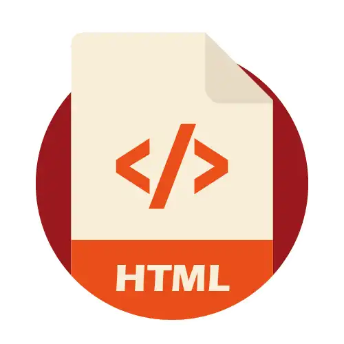

<h1 align = "center">
 Desafio de Projeto - Criar um Site com as Tags aprendidas </h1>

### Entendendo o Desafio:

### A ideia deste Desafio de Projeto é elaborar um website, utilizando uma estrutura bem básica, utilizando tags aprendidas durante as aulas práticas:

<ul>

<li text-align = "left">

<h3> Utilizar todas as tags explicadas nas aulas: 

<strong> h1 até h6, p, mark, small, i, u, strong, ol, ul, li, a, hr, sub, sup, blockquote; </strong>
</h3>

</li>

<li>

<h3> Utilizar novas tags sugeridas: 
<strong> font, del, p, abbr </strong> (a ideia é buscar estas tags na internet, entender como ela funciona e utilizar no texto).

</h3>

</li>

</ul>