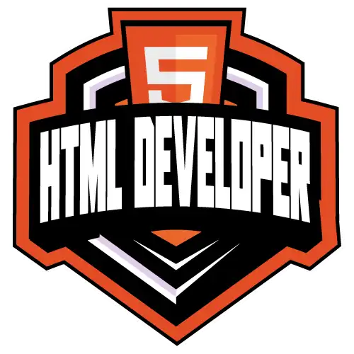

<h1 align = "center"> Formação HTML Web Developer </h1>

<h2 align = "left"> Detalhes da formação </h2>

### Você quer começar no mundo do Front-end? Então essa é a Formação perfeita para você começar a sua jornada: entenda como trabalhar com HTML, a base para criar suas primeiras páginas WEB! Aprenda na prática a como estruturar a marcação da sua página e como funciona cada tag, conheça os elementos semânticos e outras boas práticas na hora de construir sua primeira página.

### ⭐Essa é uma excelente formação para começar sua carreira como front-end.

### ⚠️Pré-requisitos: Conhecimentos básicos em Lógica de Programação e Pensamento Computacional

### Atividades:

<ul>

<li>

 ### Desafio de Código: Coloque em prática todo o conhecimento adquirido nas aulas e teste o seu conhecimento na resolução de um desafio. 
 
 </li>

<li>

### Desafio de Projeto: Construa o seu portfólio construindo projetos práticos com o conhecimento adquirido ao longo das aulas.

</li>

</ul>

### Ferramentas para o seu aprendizado:

<ul>

<li>

### Fórum: Espaço para você interagir e tirar suas dúvidas técnicas com a nossa comunidade.

</li>

<li> 

### Rooms: Espaço para você conversar com outros matriculados no bootcamp e aumentar o seu networking.

</li>

<li> 

### Matriculados: Saiba quem está participando da mesma jornada educacional que você.

</li>

<li> 

### Certificado: Baixe e compartilhe os certificados de todas as suas conquistas ao longo dessa formação.

</li>

</ul>

